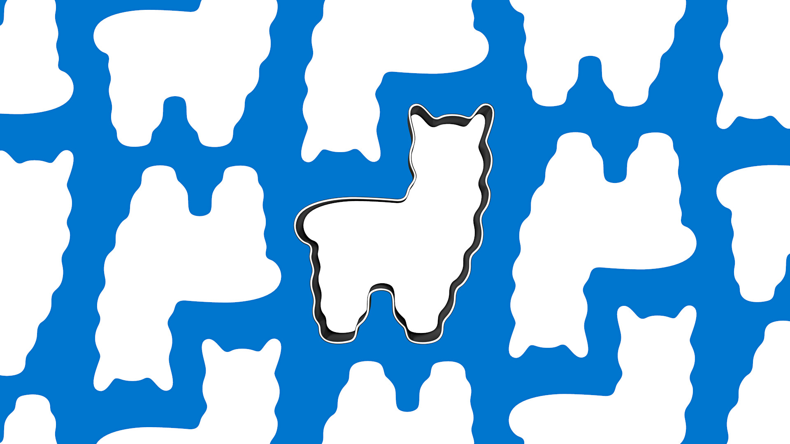

<div align="center">
  <br>
  <h1>cookiecutter for <code>R</code></h1>
</div>

**The `cookiecutter` package for `R` makes it easy to create new projects and files based on templates.** It can create directory structures and files, and customizes their contents based on predefined settings.

The package implements the core functionality of the excellent and much more flexible [Python implementation](https://github.com/cookiecutter/cookiecutter/), and complements the likewise fantastic [`usethis` package](https://usethis.r-lib.org/) that automates development steps within a project.

----

## Usage 🍪

### Installation 📦

The package is on its way to CRAN, so that you can install it via

```R
install.packages('cookiecutter')
```

Alternatively, if you like to live on the bleeding edge, you can install the development version:

```R
devtools::install_github('felixhenninger/cookiecutter@main')
```

### Making cookies 👩‍🍳

To get started, you'll need a `cookiecutter` template, and a place to extract it. For example, starting from a template directory you could run:

```R
cookiecutter::bake(
  'template_directory',
  'output_directory'
)
```

If you've downloaded a template as a compressed archive or a directory, you can clone it locally.

```R
cookiecutter::bake(
  'template.zip',
  'output_directory'
)
```

----

### Crafting a template 🛠

In principle, any directory you already have can serve as a `cookiecutter` template. Out of the box, if you use it as template, `cookiecutter` will simply copy the directory for you. Likewise, if you create a `zip`, `.tar` or `.tar.gz` archive of your directory, `cookiecutter` will unpack it into the output location.

However, there are many more things you can do to make your template more user-friendly. Specifically, `cookiecutter` will change the names and contents of files according to your specifications. The way this works is that you can insert a placeholder, `{{ cookiecutter.my_variable }}` inside a file (or in its name or directory name), and `cookiecutter` will try to replace this placeholder (curly braces and all) with the contents of `my_variable`.

If you use the placeholder alone, your users will need to supply the values of any variables when they bake the template, like so (here, we set the variable `topping`, which you could use in a file or file name via `{{ cookiecutter.topping }}`):

```R
cookiecutter::bake(
  'template.zip',
  'output_directory',
  extra_context = list(
    topping = 'sprinkles'
  )
)
```

You can help your users figure out which variables are available by adding a `cookiecutter.json` file to your template directory. If you do so, `cookiecutter` will know about the variables it needs, and prompt users to fill in or to choose a value. It will provide a default, or a list of choices, respectively.

The [format of this file](https://cookiecutter.readthedocs.io/en/stable/advanced/index.html) is documented fully in the Python cookiecutter documentation, but to give you an impression of the options, here's an example:

```json
{
  "cookie_eating_sound": "Om nom nom nom",
  "cookie_local_term": ["cookie", "biscuit"]
}
```

----

## Limitations ⚠️

The `cookiecutter` package for `R` aims to be compatible with its big sibling, but at present implements only a subset of their functionality.

Of course, few of these issues are insurmountable, and they are great places to contribute!

* We don't (yet) provide the full extent of the [Jinja templating language](https://jinja.palletsprojects.com/en/3.0.x/templates/) that `cookiecutter` uses. Specifically, at present, we don't support logic in templates.
* Naturally, we don't support _Python code in templates_.
* We don't currently support _cloning templates directly from a git repository_. You can still download the repository contents and clone from a directory or an archive.
* We don't support `~/.cookiecutterrc` files.
* We don't support running scripts automatically after populating a template.

If you're looking for the full power of [the original](https://github.com/cookiecutter/cookiecutter), we wholeheartedly recommend using it — our clone is designed to be a stop-gap, not a replacement. If we can whet your appetite, that's a win in our book!
